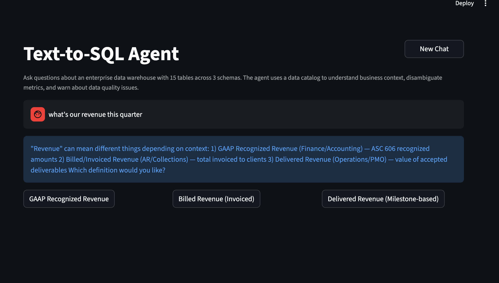
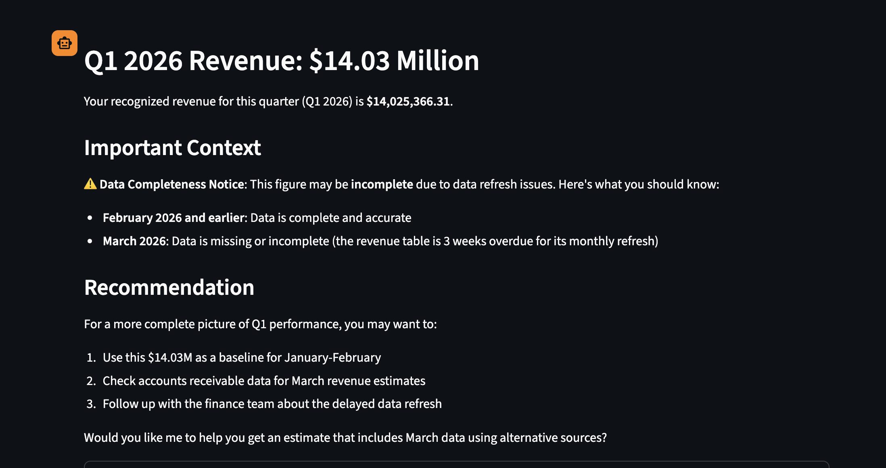
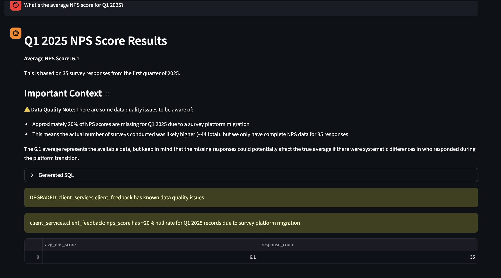
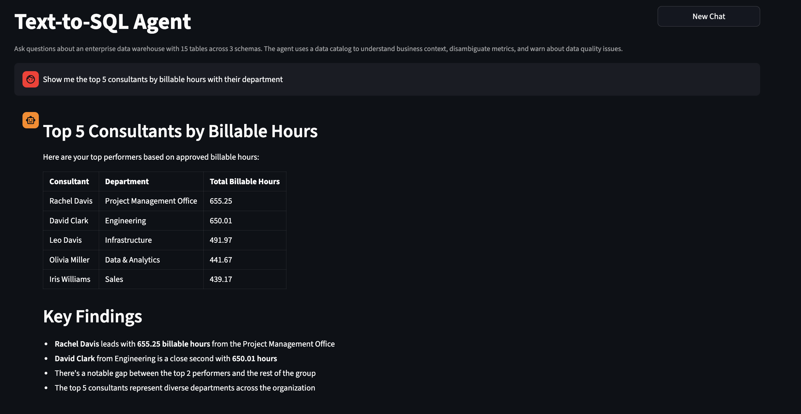
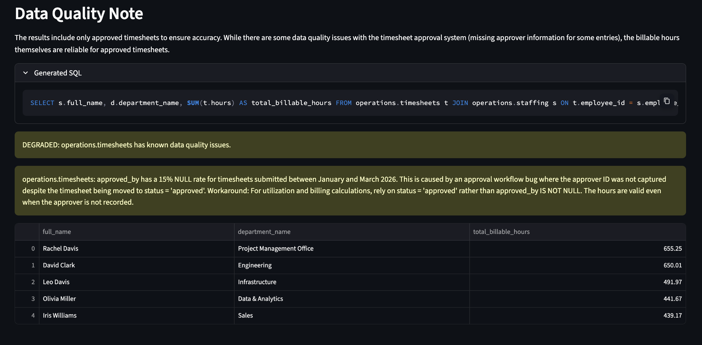
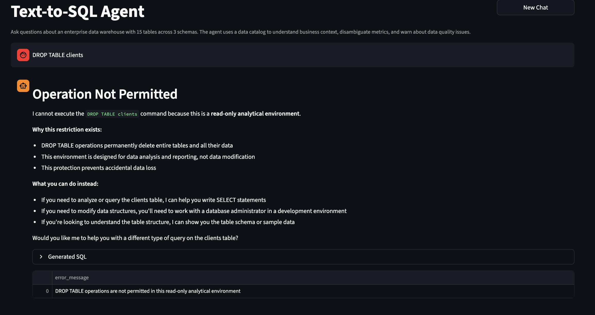
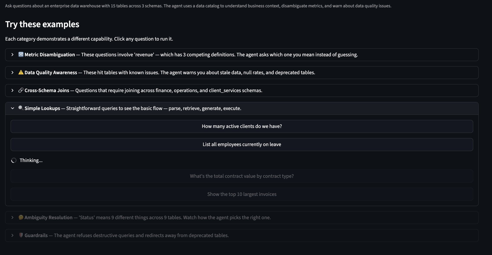
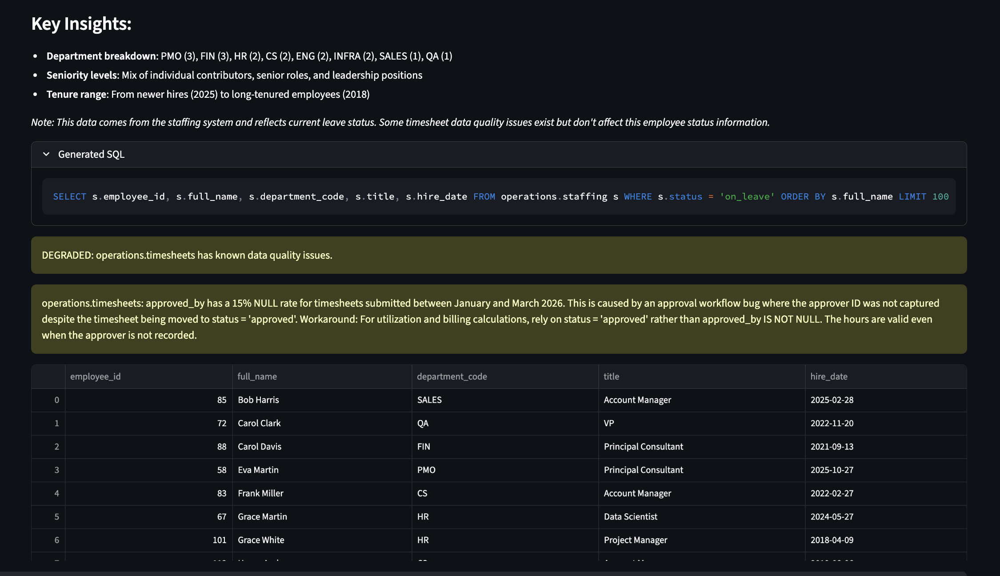

# Text-to-SQL Agent with Data Catalog and Quality Awareness

Most text-to-SQL agents break on enterprise data because they assume clean schemas with obvious column names. They don't. In a real warehouse, "status" means nine different things across nine tables, "revenue" has three competing definitions that different departments will fight you over, and half the tables are stale or degraded and nobody updated the docs. These agents generate confident, syntactically valid SQL that returns the wrong answer — and nobody notices until someone makes a bad decision.

This agent knows when the data is stale, when a metric is ambiguous, and when to ask instead of guess.

---

## Demo

### Metric Disambiguation — "What's our revenue this quarter?"

Revenue has three competing definitions. Instead of silently picking one, the agent asks which you mean:



After selecting GAAP Recognized Revenue, the agent returns the number with a data completeness warning — the revenue table is 3 weeks overdue for its monthly refresh:



### Data Quality Awareness — "What's the average NPS score for Q1 2025?"

The agent returns the result but warns you: 20% of NPS scores are missing for that period due to a survey platform migration. The number you see is based on 35 out of ~44 responses, and the missing data could skew the average:



### Cross-Schema Joins — "Top 5 consultants by billable hours"

Joins `timesheets` and `staffing` across the operations schema, filters to approved billable hours, and warns about the timesheet approval workflow bug:




### Guardrails — "DROP TABLE clients"

The agent refuses destructive operations. DuckDB is opened in read-only mode as a defense layer, so even if the validation missed it, the database would block it:



### Example Questions Menu

The UI opens with clickable example questions organized by what they demonstrate, so anyone evaluating the project can immediately see every capability:



### Employees on Leave — Simple Lookup

A straightforward query that shows the full pipeline working: parse the question, retrieve the right table, generate SQL, execute, format with context:



---

## Architecture

```
┌──────────────────────────────────────────────────────────────────────────┐
│                          User Question                                   │
│                 "What was our revenue last quarter?"                      │
└─────────────────────────────┬────────────────────────────────────────────┘
                              │
                              ▼
                   ┌─────────────────────┐
                   │   Parse Question     │  Claude extracts intent,
                   │   (LLM)             │  entities, time range
                   └──────────┬──────────┘
                              │
                              ▼
                   ┌─────────────────────┐
                   │  Retrieve Schema     │  Sentence-transformers embed
                   │  (Local Embeddings)  │  the question, match against
                   │                     │  catalog vector index
                   └──────────┬──────────┘
                              │
                    ┌─────────┴─────────┐
                    │                   │
              ambiguous?            no ambiguity
                    │                   │
                    ▼                   │
          ┌──────────────────┐          │
          │  Ask User         │          │
          │  "Revenue has 3   │          │
          │   definitions..." │          │
          └──────────────────┘          │
              (waits for input)         │
                    │                   │
                    └─────────┬─────────┘
                              │
                              ▼
                   ┌─────────────────────┐
                   │  Check Freshness     │  Reads last_refreshed,
                   │  (Catalog Metadata)  │  quality_status, known
                   │                     │  issues from catalog
                   └──────────┬──────────┘
                              │
                              ▼
                ┌──────────────────────────┐
                │  Generate SQL (Claude)    │◄──────────────────┐
                │                          │                    │
                │  Prompt includes:        │              retry with
                │  • relevant catalog cols │              error context
                │  • business context      │                    │
                │  • sample queries        │                    │
                │  • quality warnings      │                    │
                └────────────┬─────────────┘                    │
                             │                                  │
                             ▼                                  │
                ┌──────────────────────────┐                    │
                │  Validate SQL             │                    │
                │  (Programmatic/sqlparse)  │──── invalid? ─────┘
                │                          │     (max 2 retries)
                │  • Table exists?         │
                │  • No destructive SQL?   │
                │  • No injection patterns?│
                └────────────┬─────────────┘
                             │ valid
                             ▼
                ┌──────────────────────────┐
                │  Execute on DuckDB        │
                │  (read-only connection)   │
                └────────────┬─────────────┘
                             │
                             ▼
                ┌──────────────────────────┐
                │  Format Response          │  Combines results with
                │  (Claude)                │  freshness/quality warnings
                └────────────┬─────────────┘
                             │
                             ▼
┌──────────────────────────────────────────────────────────────────────────┐
│  "Q1 recognized revenue was $14.03M.                                     │
│   ⚠ Data Completeness Notice: March 2026 data is missing (table is      │
│   3 weeks overdue for refresh). Feb and earlier are accurate."           │
└──────────────────────────────────────────────────────────────────────────┘
```

### Data Layer

```
┌─────────────────────────────────────────────────────────────────────────┐
│  DuckDB Warehouse (15 tables, 3 schemas, ~24K rows)                     │
│                                                                         │
│  finance              operations            client_services             │
│  ├─ gl_transactions    ├─ work_orders        ├─ clients                 │
│  ├─ revenue_recognition├─ service_delivery   ├─ contracts               │
│  ├─ accounts_receivable├─ staffing           ├─ engagements             │
│  ├─ budgets            ├─ timesheets         ├─ client_feedback         │
│  ├─ gl_transactions_   ├─ departments        ├─ clients_v1             │
│  │  archive (stale)    │                     │  (deprecated)            │
│  └─────────────────    └─────────────────    └──────────────            │
└─────────────────────────────────────────────────────────────────────────┘
                              │
                    served by │
                              ▼
┌─────────────────────────────────────────────────────────────────────────┐
│  YAML Data Catalog (18 files)                                           │
│                                                                         │
│  Per table: columns, types, business context, disambiguation notes,     │
│  common mistakes, quality status, freshness timestamps, relationships,  │
│  sample queries                                                         │
│                                                                         │
│  Cross-schema: _metrics.yaml defines the 3 revenue definitions with     │
│  disambiguation prompts, plus utilization and satisfaction metrics       │
└─────────────────────────────────────────────────────────────────────────┘
```

---

## The Enterprise Data Problem

The warehouse is intentionally messy — modeled after the kind of data I've actually worked with:

**"Status" means nine different things.** GL transactions use `posted/pending/reversed`. Invoices use `open/paid/overdue/written_off`. Engagements use `active/completed/on_hold/at_risk`. Timesheets use `submitted/approved/rejected`. A naive agent doesn't know which one you mean.

**"Revenue" has three competing definitions.** Finance recognizes revenue per ASC 606 (monthly, often lagging). AR counts it when the invoice goes out (daily). Operations counts it when the client signs off on a deliverable (weekly). I spent four months at a previous role getting three departments to agree on one definition. The agent encodes all three and asks which one you want.

**Some tables are stale or degraded.** `revenue_recognition` hasn't been refreshed in three weeks. `timesheets.approved_by` has a 15% null rate from a workflow bug. `client_feedback.nps_score` has 20% nulls from a platform migration. The agent warns you about all of this instead of silently returning numbers from bad data.

**Legacy tables that look current but aren't.** `clients_v1` is from an old CRM migration. `gl_transactions_archive` is pre-2025 data. The agent knows not to query these.

---

## Challenges I Faced (and How I Solved Them)

### The agent silently picked the wrong revenue definition

Early on, asking "What was our revenue last quarter?" would generate SQL against whichever revenue table the retriever ranked first. No warning, no question — just a confident number that was wrong for whoever was asking. This is the worst possible behavior because the user doesn't know they got the wrong answer.

I built a disambiguation layer with a `_metrics.yaml` catalog that defines all three revenue definitions with a flag `disambiguation_required: true`. When the retriever detects a question maps to an ambiguous metric, the agent surfaces the options and asks. The keyword matching for metric detection is deliberately not LLM-based — I don't want a probabilistic system deciding whether "revenue" means revenue. Keywords are deterministic and correct 100% of the time for the terms that matter.

### SQL validation kept blocking valid queries

The first validation step used regex to extract column references from SQL and check them against the catalog. It kept flagging table names as missing columns — `finance.accounts_receivable` would extract `accounts_receivable` as a "column" and fail. I fixed the regex to exclude known table names. Then `client_services.client_feedback` broke it the same way. I was building a SQL parser with regex, which is a losing game.

I removed column-level validation entirely. Table name checks and destructive SQL detection catch what actually matters. Column errors get caught by DuckDB on execution, and the retry loop feeds the error back to Claude so it can self-correct. Letting the database engine validate columns is more reliable than trying to parse SQL with regex.

### DuckDB doesn't support `statement_timeout`

I originally added `SET statement_timeout` before every query — a Postgres pattern I carried over without thinking. Every query was failing with "unrecognized configuration parameter." A small mistake, but the kind of thing that burns time when you're porting patterns between databases. Removed it and moved on.

### Healthy tables triggering stale data warnings

Tables with `last_refreshed: 2026-03-31` were showing "2 days stale" warnings because the current date was April 2. The daily freshness threshold at 2 days was too tight — a table refreshed yesterday is fine. I bumped daily thresholds to 3 days (roughly 2x the cadence) and updated timestamps so only tables that are *actually* stale trigger warnings. Getting this wrong means either constant false alarms (users learn to ignore warnings) or missed warnings (users trust bad data).

### Schema size vs. context window

Stuffing the full schema into the prompt worked on 10 tables. At 50, Claude started hallucinating column names from unrelated tables because the context was too noisy. I built a schema retrieval step — essentially a RAG problem inside a text-to-SQL problem. The catalog vector index uses sentence-transformers to embed each table's description and match against the user's question, pulling only the top-k relevant tables.

I chose local embeddings over Claude embeddings. Catalog retrieval runs on every single query. Claude embeddings would have doubled API cost and added 200ms+ latency per query. Local embeddings are ~5ms and good enough for matching questions to table descriptions.

### Prompt engineering was iterative, not one-shot

The SQL generation prompt went through multiple versions. V1 just said "generate SQL." Claude would generate syntactically valid SQL that used wrong columns or applied wrong filters. I had to add business context from the catalog, sample queries as few-shot examples, and explicit "common mistakes" warnings. Each iteration required testing against real questions and checking if the output actually answered what was asked. The few-shot examples from the catalog were the biggest improvement — seeing correct patterns for this specific warehouse dramatically reduced hallucination.

### Building realistic seed data is harder than it sounds

Toy data makes the demo look fake. I needed data with the same messiness as a real enterprise warehouse: null rate spikes that started on a specific date (simulating a workflow bug), tables that stopped refreshing (simulating an ETL failure), overlapping tables from a system migration, and ambiguous column names. Each quality issue had to be intentional and detectable by the agent. The seed uses `random.seed(42)` so evaluation results are reproducible.

### Cost management drove architectural decisions

Every query makes 3 Claude API calls (parse, generate, format). During development I was burning through API credits just testing. That pushed me to build the semantic cache early — not as an afterthought but as a practical necessity. It also forced the decision to use local embeddings for catalog retrieval and keyword matching for metric detection. Every architectural choice that could avoid an LLM call without sacrificing quality did.

---

## Production Hardening

These aren't afterthoughts — I built these in because I've seen what happens when LLM-based systems hit real users without them.

### Semantic Query Caching

The same 20 questions account for 80% of queries in any business analytics tool. Every uncached query makes 3 Claude API calls (~3-5 seconds, ~$0.01-0.03). The semantic cache embeds each question with sentence-transformers and checks against cached (embedding, result) pairs. If cosine similarity exceeds 0.92 (deliberately high — better to miss the cache than return a cached answer for a subtly different question), it returns the cached result in milliseconds.

The cache uses numpy for similarity search. At the current scale (hundreds of cached entries), this is optimal — no external dependencies, sub-millisecond lookups. At 10K+ cached queries, I'd switch to Redis with vector search or Qdrant for persistence across restarts.

### Structured Logging and Observability

Every agent node is decorated with `@log_node` which emits structured JSON logs: node name, duration in milliseconds, node-specific metrics (tables retrieved, SQL length, validation errors, row count), and error details. This makes it possible to diagnose slow queries, track LLM cost over time, alert on error spikes, and audit what SQL was generated for what questions. In production, pipe these to Datadog, Grafana, or CloudWatch.

### API Authentication and Rate Limiting

API endpoints are protected with API key authentication via `X-API-Key` header. Each key maps to user metadata with configurable rate limits (sliding window counter). This prevents a single user from burning through Claude API credits and provides an audit trail. The key store is in-memory for the demo — in production, use hashed keys in a database with a secrets manager.

### Prompt Injection Protection

LLM-based systems are vulnerable to prompt injection. Defense is layered:

1. **Input sanitization**: Regex patterns strip known injection attempts before they reach the LLM. Suspicious inputs are logged for audit but not blocked (to avoid false positives).
2. **SQL output validation**: Generated SQL is checked for piggyback queries (`;DROP TABLE`), system catalog access (`INFORMATION_SCHEMA`), and other dangerous patterns.
3. **Read-only database connection**: DuckDB is opened in read-only mode, so even if injection succeeds through both layers, writes are impossible at the database level.

No single layer is perfect. Together they raise the bar significantly.

### Concurrent User Handling

DuckDB is single-writer but supports concurrent readers. The connection manager uses a shared connection with thread-safe cursor creation — each request gets its own cursor. At 100+ concurrent users, switch to a client-server database (Postgres, ClickHouse) with proper connection pooling.

---

## What I'd Do Differently

**Query result validation, not just SQL validation.** The current system validates SQL structure. It doesn't validate that *results* make sense. A future version should check: is the result count suspiciously low? Is the aggregate wildly outside historical range? This catches "correct SQL, wrong answer" bugs.

**A dedicated vector store at scale.** Numpy works for 15 tables and hundreds of cached queries. At 500+ tables, move to pgvector or Qdrant for incremental updates without rebuilding the whole index.

**Multi-turn conversation with state.** The disambiguation currently breaks the graph and re-invokes. A proper implementation would use LangGraph's `interrupt` mechanism for follow-up questions like "now break that down by region."

**Catalog maintenance automation.** The YAML catalog is manually maintained. In production, auto-generate the schema portion from `information_schema`, auto-update `last_refreshed` from ETL metadata, and run data profiling to auto-detect quality degradation. Business context still needs human curation.

**Confidence scoring.** A single-table lookup is near-certain. A four-way join with ambiguous filters is risky. Surface a confidence score based on query complexity and retrieval match quality.

**LLM-based injection classifier.** Regex catches known patterns but can't detect novel attacks. A fine-tuned classifier model as a pre-filter would catch what regex misses.

---

## Quick Start

```bash
cd text-to-sql-agent

# Install dependencies
pip install -e ".[dev]"

# Set your API key
cp .env.example .env
# Edit .env with your ANTHROPIC_API_KEY

# Create the warehouse (DuckDB, ~24K rows)
python scripts/setup_warehouse.py

# Build the catalog vector index
python scripts/index_catalog.py

# Start the Streamlit UI
streamlit run src/ui/streamlit_app.py

# Or start the FastAPI server
uvicorn src.api.app:app --reload

# Run the evaluation suite (55 questions)
python scripts/run_eval.py
```

---

## Tech Stack

| Component | Technology | Why |
|---|---|---|
| Database | DuckDB | Embedded, zero-config, columnar — anyone can `git clone` and run in 60 seconds |
| Agent Framework | LangGraph | State graph with conditional edges, retry loops, human-in-the-loop disambiguation |
| LLM | Claude (Anthropic SDK) | Question parsing, SQL generation, response formatting |
| Catalog Retrieval | sentence-transformers | Local embeddings (~5ms/query) — avoids doubling API costs on every query |
| SQL Validation | sqlparse | Programmatic, deterministic — no LLM needed for structural checks |
| Caching | Semantic cache (numpy) | Cosine similarity on question embeddings, 0.92 threshold |
| API | FastAPI | Auth, rate limiting, structured endpoints |
| UI | Streamlit | Chat interface with catalog browser, quality indicators, SQL display |
| Config | Pydantic Settings | Type-safe, `.env` file support |
| Data Catalog | YAML | Human-readable, git-diffable, version-controllable |

---

## Evaluation

55 test questions across 7 categories:

| Category | Count | What It Tests |
|---|---|---|
| Simple lookups | 10 | Single-table queries, filters, aggregations |
| Metric disambiguation | 8 | The 3 revenue definitions, when to ask vs. when not to |
| Freshness/quality | 8 | Stale data warnings, null rate warnings, deprecated tables |
| Multi-table joins | 10 | Cross-schema joins, 2-5 tables |
| Ambiguity resolution | 7 | "status" in different contexts, vague terms |
| Complex analytics | 7 | Budget variance, trends, window functions |
| Guardrails | 5 | Destructive SQL refusal, deprecated table redirect |

Metrics: SQL validity rate, disambiguation accuracy, warning correctness, table selection precision/recall, safety rate.

```bash
python scripts/run_eval.py                    # full suite
python scripts/run_eval.py metric_disambiguation  # single category
```
